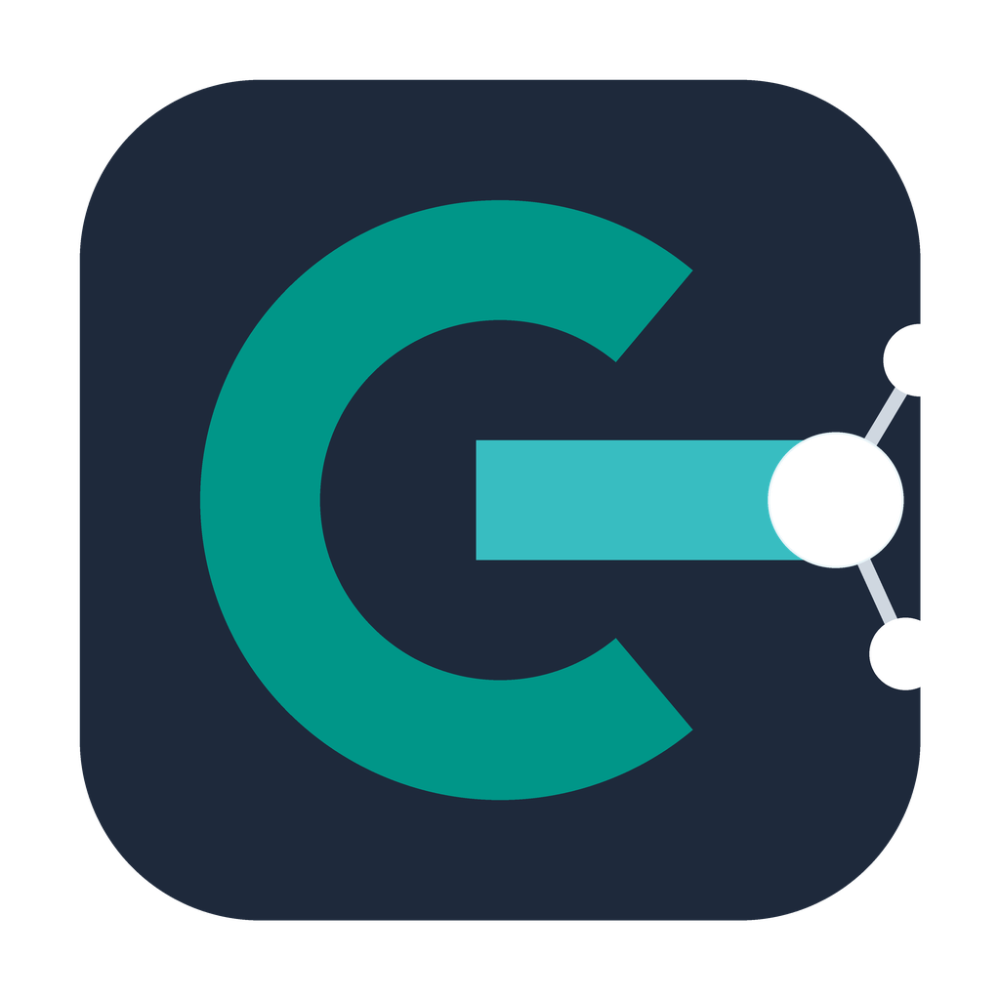
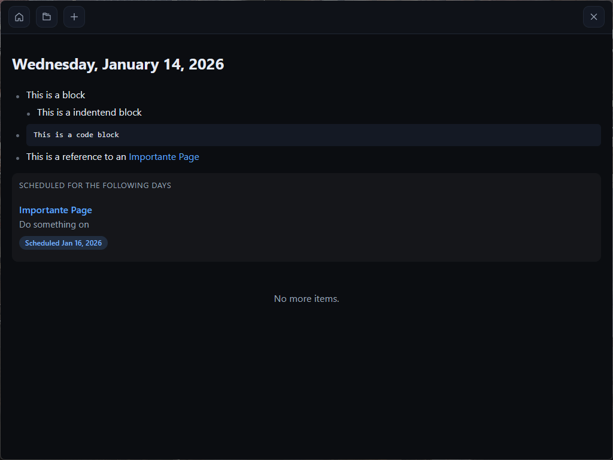

# Glog

A minimalist, local-first journaling and knowledge management application. Built with Go and Svelte for a fast, native desktop experience.

<p align="center">
  
</p>

<p align="center">
  
</p>

## Features

### Daily Journaling
- **Auto-opens to today's entry** - Start writing immediately
- **Infinite scroll** - Seamlessly browse through your journal history
- **Scheduled tasks** - Add tasks with `/scheduled YYYY-MM-DD` and see upcoming items on your daily view

### Block-Based Editor
- **Outliner-style editing** - Organize thoughts with hierarchical, indented blocks
- **Markdown support** - Write in markdown, see it rendered beautifully
- **Auto-save** - Changes are saved automatically as you type
- **Image paste** - Paste images directly from your clipboard

### Bi-Directional Linking
- **WikiLinks** - Connect notes using `[[Document Title]]` syntax
- **Auto-complete** - Get suggestions as you type links
- **Backlinks** - See all documents that reference the current page

### Full-Text Search
- **Instant search** - Find anything across all your documents
- **Fuzzy matching** - Handles typos gracefully
- **Phrase search** - Use quotes for exact matches: `"exact phrase"`

### Local & Private
- **All data stays on your machine** - No cloud, no sync, no tracking
- **BoltDB storage** - Fast, reliable embedded database
- **Single file database** - Easy to backup (`glog.db`)

## Keyboard Shortcuts

| Shortcut | Action |
|----------|--------|
| `Tab` | Indent block |
| `Shift+Tab` | Outdent block |
| `Enter` | New block / split at cursor |
| `Backspace` (at start) | Merge with previous block |
| `Arrow Up/Down` | Navigate between blocks |
| `Escape` | Exit editing mode |

## Getting Started

### Prerequisites

- [Go](https://go.dev/) 1.21+
- [Node.js](https://nodejs.org/) 16+
- [Wails CLI](https://wails.io/docs/gettingstarted/installation)

### Installation

```bash
# Clone the repository
git clone https://github.com/yourusername/glog.git
cd glog

# Install frontend dependencies
cd frontend && npm install && cd ..

# Run in development mode
wails dev
```

### Building

```bash
wails build
```

The executable will be in `build/bin/`.

## Importing from Logseq

Glog includes a CLI tool to import your existing Logseq graph:

```bash
# Build the import tool
go build -o glog-import ./cmd/logseq-import

# Import your Logseq graph
./glog-import /path/to/logseq-graph

# Options
./glog-import --journals-only /path/to/graph  # Import only journals
./glog-import --pages-only /path/to/graph     # Import only pages
./glog-import --dry-run /path/to/graph        # Preview without writing
```

## Tech Stack

| Component | Technology |
|-----------|------------|
| Framework | [Wails](https://wails.io/) v2 |
| Backend | Go |
| Frontend | Svelte + TypeScript |
| Database | BoltDB |
| Search | Bleve |
| Editor | CodeMirror 6 |

## Data Storage

```
./glog.db           # Main database
./glog.db.bleve/    # Search index
./assets/           # Pasted images
```

## License

MIT License - see [LICENSE](LICENSE) for details.
